# whatsFood

> Um sistema Web para envio de <b>`Pedidos`</b> com encaminhamento direto para o  <b>`whatsapp`</b> 

## Funcionamento

O cliente inicia uma conversa com o estabelecimento de modo automatico o estabelecimento envia uma menssagem com o link de forma estantanea para o cliente, assim o cliente entra no site e realiza seu pedido apos finalizar ele é direcionado para o whatsapp com seu pedido realizado e apenas envia seu pedido para o estabelecimento.

Usando o `WhatsFood` os estabelecimentos tende a economizar mais tenpo em seus pedidos.

Para usar o whatsFood não precisa de nenhum requisito especial de qualquer lugar e qualquer plataforma pode-se usar.

- Com  `WhatsFood`o cliente pode pedir o lanche para entrega ou retirada no local tudo isso na hora de realizar seu pedido.
- Se o cliente optar por entrega o `WhatsFood` enviara sua localização fixa para o entregador achalo mais facilmente.
- O `WhatsFood` é conpativel com aparelhos `Mobile`, veja uma das vantagens do WhatsFood.
    - Com o `WhatsFood` o cliente tem seu pedido calculado em tempo de execução sendo assim sabe quanto tera que pagar enquanto escolhe         o lanche
    - Interface minimalista e simples.
    - Alertas de promoções
    
## ScreenShots (prints de tela)

<table>
 <tr>
    <td>
      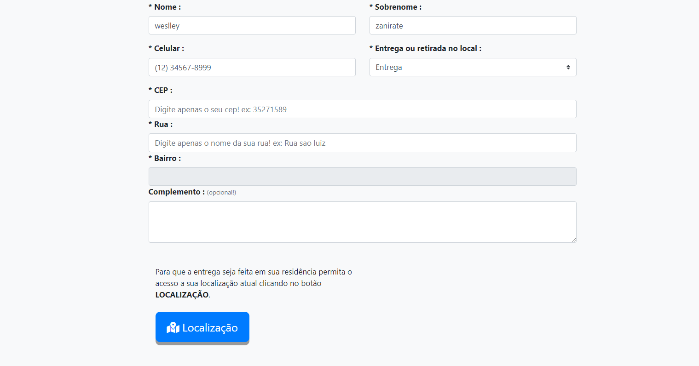
    </td>
    <td>
      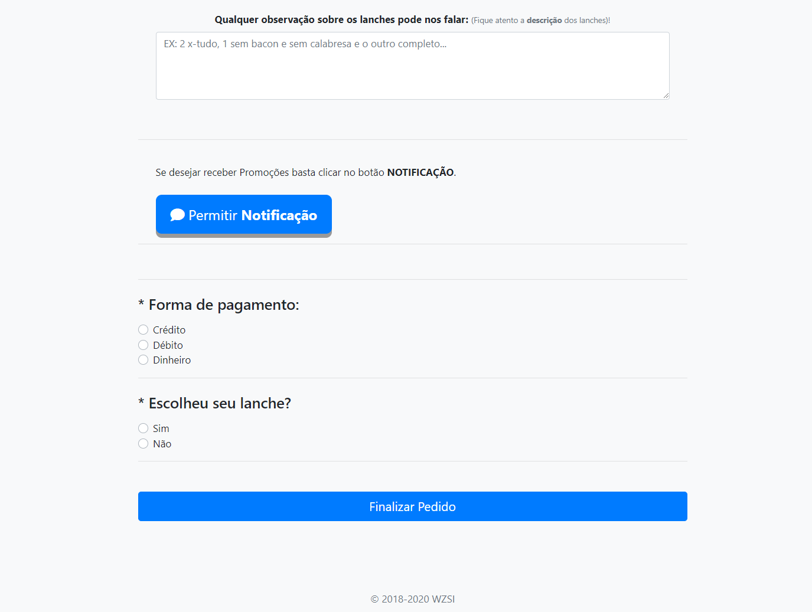
    </td>
 </tr>
 <tr>
    <td>
      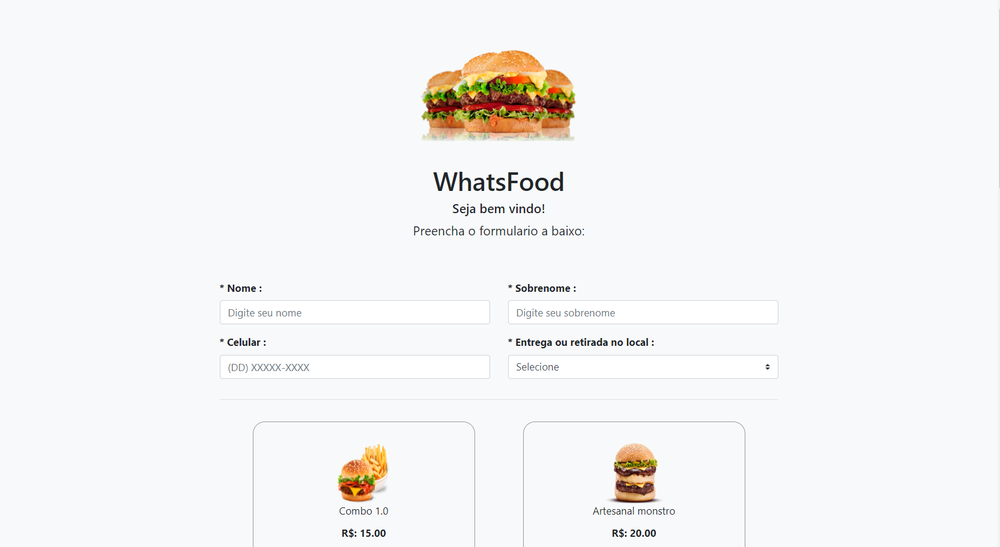
    </td>    
      <td>
      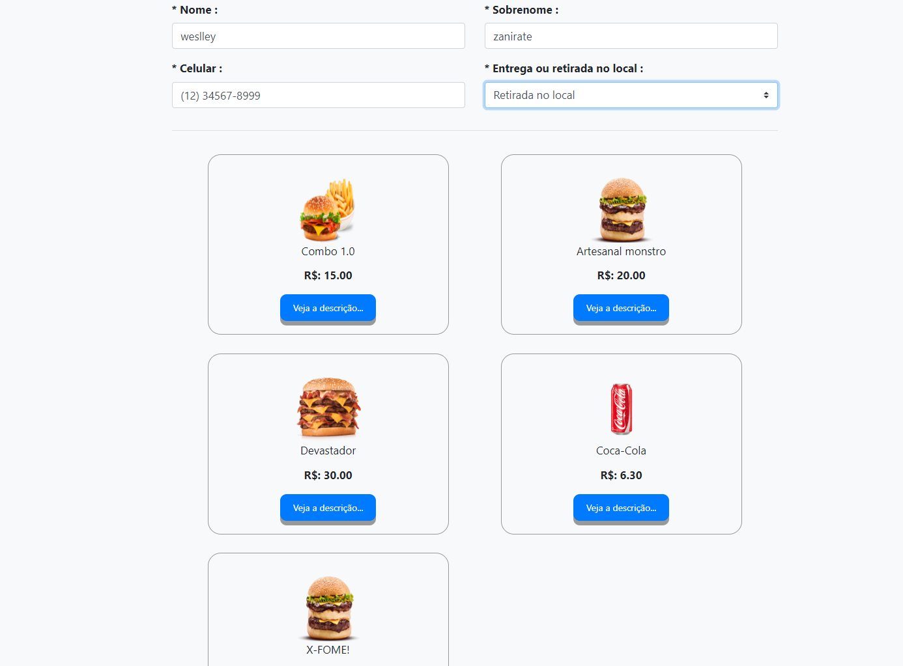
    </td>
 </tr>
    <br>
 <tr>
      <td>
      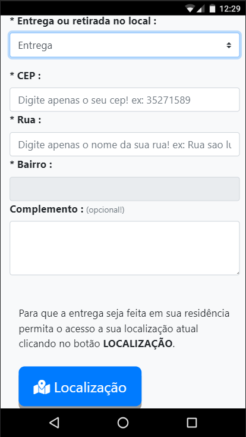
    </td>
      <td>
      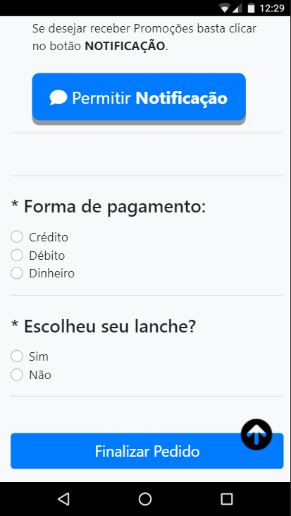
    </td>
   </tr>
   <tr>
      <td>
      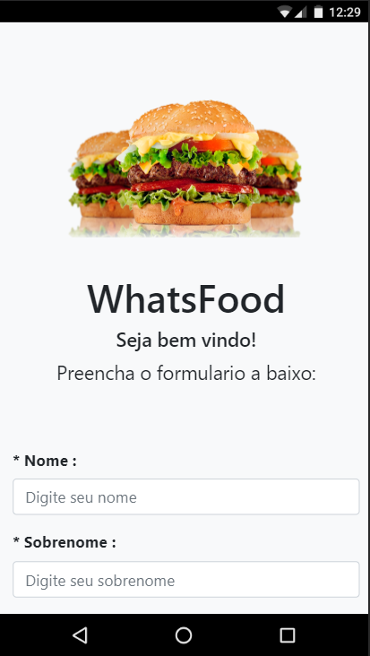
    </td>
      <td>
      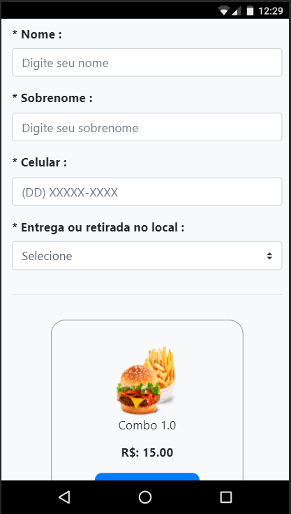
    </td>
  </tr>
  <tr>
      <td>
      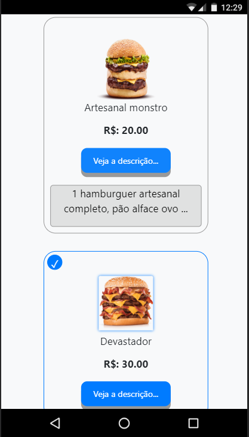
    </td>
      <td>
      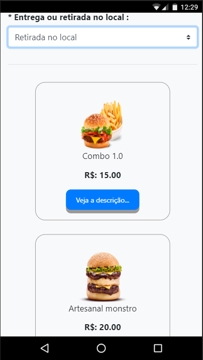
    </td>
      <td>
      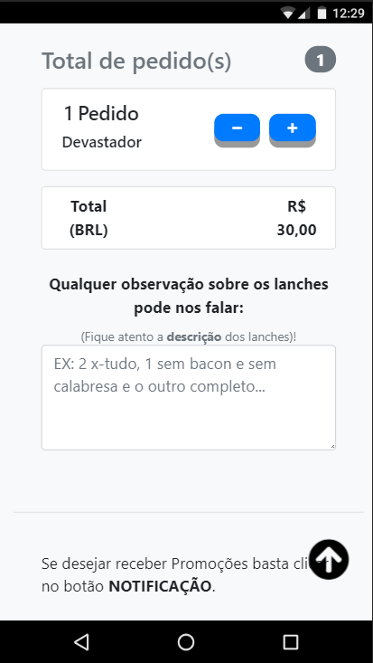
    </td>
  </tr>
</table>


## Dependencies

```
php compose
```

## Usage

```
install a sql in whatsfood/conexao/sql/whatsfood.sql
```
